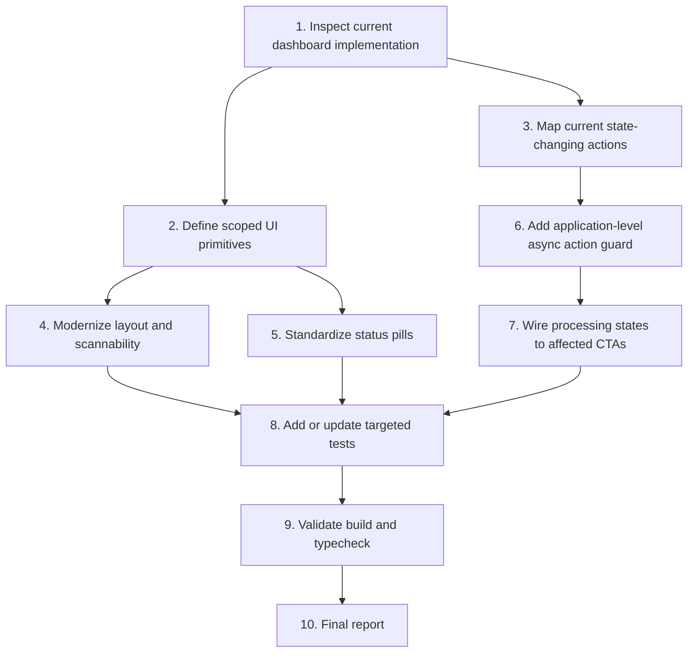

# Implementation Plan

## Overview

Implement the DW AgentOps Tasks Control dashboard UI enhancement and CTA throttling as a scoped frontend change. The work should first inspect the current dashboard implementation, then add or reuse small UI primitives, wire action-specific processing state, add targeted tests where project convention supports them, and validate with the repository commands.

Strict scope:

- Only change the AgentOps dashboard surface and directly required helper components/hooks.
- Do not change backend contracts, workflow state rules, or persistence schema.
- Do not implement unrelated dashboard features.

## Task Dependency Graph



```json
{
  "waves": [
    {
      "id": "wave-1",
      "description": "Inspection and scope confirmation",
      "tasks": ["1", "2", "3"]
    },
    {
      "id": "wave-2",
      "description": "UI hierarchy and scannability implementation",
      "tasks": ["4", "5"]
    },
    {
      "id": "wave-3",
      "description": "CTA processing state and duplicate guard implementation",
      "tasks": ["6", "7"]
    },
    {
      "id": "wave-4",
      "description": "Testing and validation",
      "tasks": ["8", "9"]
    },
    {
      "id": "wave-5",
      "description": "Final reporting",
      "tasks": ["10"]
    }
  ]
}
```

## Tasks

- [ ] 1. Inspect current dashboard implementation
  - Locate the DW AgentOps Tasks Control dashboard entry component.
  - Locate current Overview, Workflow, and Selected Task card rendering.
  - Locate current Save token, Create, SUBMIT, CANCEL, and Add link handlers.
  - Identify existing shared Button, Card, Input, Toast, Alert, and Status components.
  - Confirm whether the project uses CSS modules, utility classes, inline styles, or another styling convention.
  - _Requirements: 1, 2, 3, 4, 5, 6, 7, 8_

- [ ] 2. Define scoped UI primitives
  - Reuse existing shared components where available.
  - If missing, add AgentOps-local primitives for `AsyncButton`, `StatusPill`, `TechnicalId`, and `CounterTile`.
  - Keep component APIs small and typed.
  - Avoid broad design-system rewrites.
  - _Requirements: 1, 2, 3, 4, 5, 8_

- [ ] 3. Map current state-changing actions
  - Identify the current request functions or handlers for Save token, Create, SUBMIT, CANCEL, and Add link.
  - Define action keys for each affected CTA.
  - Confirm which actions can run independently and which require form-level locking.
  - Confirm existing success and failure UI behavior before changing it.
  - _Requirements: 5, 6, 7, 8_

- [ ] 4. Modernize layout and scannability
  - Standardize card padding, height behavior, border radius, and grid spacing across Overview, Workflow, and Selected Task.
  - Modernize input field styling for REST credential, Title, Description, and Target task ID.
  - Improve technical ID readability with monospace or technical text treatment.
  - Update counter tiles so values are visually prominent and labels sit clearly underneath.
  - Verify responsive behavior without horizontal overflow.
  - _Requirements: 1, 2, 4, 8_

- [ ] 5. Standardize status pills
  - Create or centralize status-to-tone mapping.
  - Apply DRAFT, READY, CANCELLED, RUNNING, and fallback styles.
  - Add active styling for RUNNING where practical without distracting animation.
  - Replace duplicated inline status styles in the dashboard surface.
  - _Requirements: 3, 8_

- [ ] 6. Add application-level async action guard
  - Add an action-specific loading map or equivalent state model.
  - Set loading before invoking each request function.
  - Ignore redundant triggers when the same action key is already loading.
  - Clear loading state in a finally-equivalent path after success or failure.
  - Keep duplicate click prevention silent for the user.
  - _Requirements: 5, 6, 7, 8_

- [ ] 7. Wire processing states to affected CTAs
  - Wire Save token to processing label `Saving...` and disabled UI state.
  - Wire Create to processing label `Creating...` and disabled UI state.
  - Wire SUBMIT to processing label `Submitting...` and disabled UI state.
  - Wire CANCEL to processing label `Cancelling...` and disabled UI state.
  - Wire Add link to processing label `Adding...` and disabled UI state.
  - Apply `disabled=true`, blocked cursor treatment, approximate 60% opacity, loading text or spinner, and accessible loading text.
  - Re-enable each CTA after success or failure unless the updated view replaces it.
  - _Requirements: 5, 6, 7, 8_

- [ ] 8. Add or update targeted tests
  - Add unit tests for status-to-tone mapping if a test framework exists.
  - Add unit tests for the async action guard or equivalent pure logic if practical.
  - Add component tests for `AsyncButton` only if current project convention supports component testing.
  - Add manual smoke checklist if automated UI tests do not exist.
  - Cover rapid-click behavior for all affected CTAs.
  - Cover failure behavior and CTA re-enable behavior.
  - _Requirements: 3, 5, 6, 7, 8_

- [ ] 9. Validate build and typecheck
  - Run `npm run typecheck`.
  - Run `npm run build`.
  - Run relevant tests if present.
  - Record any validation command that cannot run and why.
  - _Requirements: 1, 2, 3, 4, 5, 6, 7, 8_

- [ ] 10. Final report
  - Report files changed.
  - Report UI behavior changed.
  - Report CTA throttling behavior changed.
  - Report validation results.
  - Report risks, limitations, and follow-up recommendations.
  - _Requirements: 1, 2, 3, 4, 5, 6, 7, 8_

## Notes

- Keep this spec under `.kiro/specs/AGENTOPS-UI-01-dashboard-cta-throttling/`.
- Do not combine this workstream with persistence, state engine, or dashboard feature expansion.
- Do not change database schema unless a later spec explicitly requires it.
- Do not change backend API contracts for this UI enhancement.
- Do not expose raw REST credential values in rendered errors or logs.
- Reuse existing shared UI components first.
- Prefer feature-local components if shared components are absent or risky to change.
- Validation commands from this repository are `npm run typecheck` and `npm run build`.
