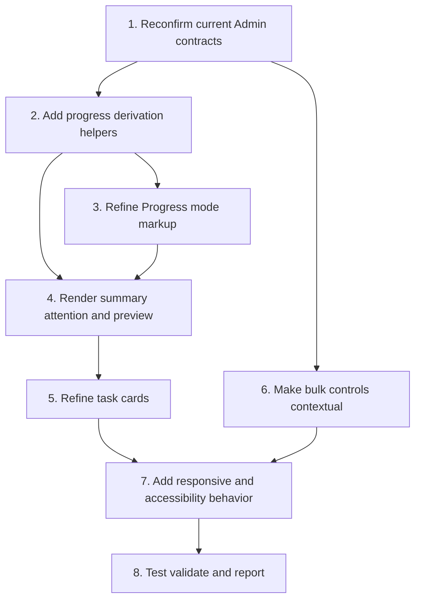

# Implementation Plan

## Overview

Implement the progress-first AgentOps Admin experience as a scoped refinement of the current static HTML/CSS/JavaScript surface. The existing Progress, Tasks, Assign, and Flow modes, task tree, dependency graph, selected-task detail, bulk API operations, workflows, configuration diagnostics, and CTA protections must remain intact.

Strict scope for the future implementation:

- Progress summary, attention queue, progress preview, task-card scan order, contextual bulk presentation, responsive styling, accessibility, and targeted tests.
- No backend, database, migration, State Engine, auth, route-policy, dependency, deployment, or production-data change.

## Task Dependency Graph



```json
{
  "waves": [
    {
      "id": "wave-1",
      "description": "Protected-base inspection and contract confirmation",
      "tasks": ["1"]
    },
    {
      "id": "wave-2",
      "description": "Pure progress derivation foundation",
      "tasks": ["2"]
    },
    {
      "id": "wave-3",
      "description": "Progress mode structure and rendering",
      "tasks": ["3", "4"]
    },
    {
      "id": "wave-4",
      "description": "Task scanning and contextual bulk behavior",
      "tasks": ["5", "6"]
    },
    {
      "id": "wave-5",
      "description": "Responsive accessibility and validation",
      "tasks": ["7", "8"]
    }
  ]
}
```

## Tasks

- [ ] 1. Reconfirm current Admin contracts and DOM hooks
  - Read `public/admin/index.html`, `public/admin/app.js`, `public/admin/bulk.js`, and `public/admin/styles.css` from the approved base SHA.
  - Confirm IDs and data attributes used by event listeners, MutationObservers, task selection, graph selection, mobile navigation, configuration, and workflow controls.
  - Confirm every task state returned by current schemas and tests.
  - Confirm current request payloads for task loading, transitions, links, bulk updates, bulk transitions, bulk links, and delete.
  - Record the current behavior of Progress, Tasks, Assign, and Flow modes before editing.
  - Confirm `AGENTOPS-UI-01` CTA protections that must be preserved.
  - _Requirements: 1, 2, 4, 5, 6, 7, 8_

- [ ] 2. Add pure progress derivation helpers and tests
  - Add or isolate pure helpers for raw-state normalization, overall summary, attention classification, and deterministic preview sorting.
  - Calculate actionable total as total minus cancelled and guard the zero denominator.
  - Preserve unknown states and prohibit fabricated task percentages.
  - Classify idle only from a valid `updated_at` older than 48 hours and never call it overdue.
  - Add unit tests for known and unknown states, cancelled denominator behavior, zero tasks, malformed timestamps, attention priority, and preview ordering.
  - Do not perform network calls or mutate task objects from these helpers.
  - _Requirements: 2, 3, 4, 8_

- [ ] 3. Refine existing Progress mode markup
  - Add semantic regions for overall summary, Needs attention, and progress preview inside the existing Progress panel.
  - Place progress regions before Create task and Bulk create tasks forms.
  - Preserve `createTaskForm`, `bulkCreateTaskForm`, `metrics`, and current mobile panel/navigation hooks.
  - Keep Tasks, Assign, and Flow panel ownership unchanged.
  - Add explicit loading, healthy-empty, no-task, and error containers.
  - _Requirements: 1, 3, 6, 7, 8_

- [ ] 4. Render overall summary, attention queue, and progress preview
  - Wire `loadTasks()` and the existing render cycle to refresh Progress mode from `state.tasks`.
  - Render completed/actionable text, accessible percentage, progress bar, and Ready/Running/Blocked/Done counters.
  - Render a bounded attention queue for failed, blocked, pending approval, pending review, and valid idle tasks.
  - Render a bounded progress preview using deterministic group, priority, update-time, and task-ID ordering.
  - Open the matching task or switch to Tasks/Assign when a preview or attention item is activated.
  - Preserve safe error details and request IDs without exposing credentials.
  - _Requirements: 1, 2, 3, 4, 7, 8_

- [ ] 5. Refine task cards for progress scanning
  - Update task card hierarchy to prioritize title, status, priority, agent/run cue, and update time.
  - Move the full technical ID to secondary metadata or selected-task detail while preserving full-value access.
  - Use current state labels and status tone helpers; preserve unknown raw states visibly.
  - Preserve `.task-card[data-task-id]`, task-tree nesting, card click selection, selected highlighting, checkbox injection, filters, and graph behavior.
  - Use blocker or next-step content only when verified fields exist; otherwise render a neutral cue.
  - _Requirements: 2, 3, 4, 6, 7, 8_

- [ ] 6. Make bulk controls contextual without changing API contracts
  - Keep `selectedTaskIds` in `bulk.js` as the selection source of truth.
  - Collapse or de-emphasize full bulk controls when selected count is zero.
  - Show a compact selected-state toolbar with count and access to update, transition, link, and secondary actions.
  - Preserve PATCH, transition, and link request payloads and partial-success reporting.
  - Place delete behind a secondary action and require explicit confirmation.
  - Remove silent force escalation from the default UI path; stop and request separate scope if backend constraints require a force-only behavior change.
  - Verify select-visible, hidden selection, re-rendered checkbox state, and selection clearing after successful deletion.
  - _Requirements: 5, 7, 8_

- [ ] 7. Add responsive and accessibility behavior
  - Add scoped CSS for summary, progress bar, counters, attention rows, preview cards, and contextual bulk toolbar using current variables.
  - Verify mobile first viewport shows progress before administrative forms.
  - Verify no horizontal overflow at 390px and 360px.
  - Keep task graph out of the initial Progress flow and preserve its secondary Tasks view.
  - Expose selected mode, progress text, status labels, and selected-task count accessibly.
  - Keep keyboard activation for mode controls, preview items, task cards, and bulk controls.
  - _Requirements: 1, 4, 5, 6, 7, 8_

- [ ] 8. Run regression validation and produce the final report
  - Run unit tests for progress helpers.
  - Run `npm run typecheck`.
  - Run `npm run build`.
  - Run `npm test`.
  - Manually smoke desktop, 390px, and 360px layouts.
  - Verify task loading, search, quick filters, list/graph toggle, task selection, detail loading, transitions, links, bulk update, bulk transition, bulk link, delete cancellation, workflows, configuration, and CTA processing protections.
  - Review the full diff for unrelated files, secrets, generated noise, dependency changes, weakened tests, or CI changes.
  - Record current-head CI and Governance Validation evidence; report any inherited baseline failure separately from feature regressions.
  - Report files changed, behavior changed, validation results, unperformed checks, residual risks, and gates not granted.
  - _Requirements: 1, 2, 3, 4, 5, 6, 7, 8_

## Notes

- Keep the specification under `.kiro/specs/AGENTOPS-UI-02-progress-first-task-dashboard/`.
- The specification PR itself adds only `requirements.md`, `design.md`, and `tasks.md`; it does not implement runtime UI changes.
- Future implementation must use a new scoped approval bound to its exact runtime files and base SHA.
- Do not change backend API contracts, database schema, migrations, workflow states, auth, route policies, rate limits, or audit behavior.
- Do not introduce a frontend framework or new dependency.
- Preserve `AGENTOPS-UI-01` processing states and duplicate-request guards.
- Do not silently use forced destructive operations.
- DS Admin task registration requires a separate production-data authority and is not part of this plan's repository PR.
