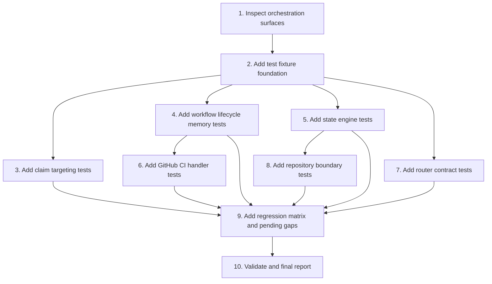

# Implementation Plan

## Overview

Create a focused AgentOps orchestration test suite for DS MCP. The work is limited to test cases, fixtures, and minimal testability helpers when strictly required. It should first cover current behavior, then document current gaps against the Phase 7 hardening direction.

Primary implementation target:

```txt
.kiro/specs/DS-OPS-08-agent-orchestration-test-cases/
  requirements.md
  design.md
  tasks.md
```

Primary test target:

```txt
test/*.test.ts
```

## Task Dependency Graph



```json
{
  "waves": [
    {
      "id": "wave-1",
      "description": "Inspection and test harness foundation",
      "tasks": ["1", "2"]
    },
    {
      "id": "wave-2",
      "description": "Pure and memory-safe orchestration tests",
      "tasks": ["3", "4", "5"]
    },
    {
      "id": "wave-3",
      "description": "Webhook, router, and repository boundary tests",
      "tasks": ["6", "7", "8"]
    },
    {
      "id": "wave-4",
      "description": "Regression matrix, validation, and reporting",
      "tasks": ["9", "10"]
    }
  ]
}
```

## Tasks

- [ ] 1. Inspect orchestration surfaces
  - Read `package.json` and confirm `npm test` uses `tsx --test test/*.test.ts`.
  - Read `src/asyncWorkflowStore.ts` and map memory fallback behavior for workflow create, claim, submit result, next task, and CI event handling.
  - Read `src/agentops/claimTargeting.ts` and map filter fields, merged context rules, and non-retryable claim failure reasons.
  - Read `src/state/stateEngine.ts` and map next-task, retry, dead-letter, and final success rules.
  - Read `src/agentops/router.ts` and map route-level schema/error behavior.
  - Read `src/agentops/githubWebhook.ts` and map ignored/final event normalization plus signature verification.
  - Read `src/repositories/orchestrationRepository.ts` and identify pure functions and Supabase-bound functions that can be tested safely.
  - Confirm whether existing `test/` folder exists; do not overwrite any current tests.
  - _Requirements: 1, 2, 3, 4, 5, 6, 7_

- [ ] 2. Add test fixture foundation
  - Create `test/helpers/agentopsFixtures.ts` only if shared fixtures reduce duplication.
  - Add fixture builders for workflow, async task, GitHub webhook payloads, router harness, and app config with Supabase disabled.
  - Use deterministic fixture values for `repo`, `repo_owner`, `repo_name`, `branch`, `repo_branch`, `pr_number`, and `head_sha`.
  - Add unique suffix helpers where memory fallback module state may leak across tests.
  - Keep fixtures small and secret-free.
  - Prefer Node built-in `node:test` and `node:assert/strict`.
  - _Requirements: 1, 2, 4, 5, 6, 7_

- [ ] 3. Add claim targeting tests
  - Create `test/claimTargeting.test.ts`.
  - Test `task_id` exact match accepts the intended task and rejects a different task.
  - Test `workflow_id` exact match accepts tasks under the intended workflow and rejects tasks under another workflow.
  - Test `repo` full-name match against workflow context.
  - Test `repo_owner` and `repo_name` match when full `repo` is absent.
  - Test `branch` and `repo_branch` aliases against merged context.
  - Test `pr_number` numeric matching from both numeric and string context values.
  - Test task payload overrides or supplements workflow context according to current merge behavior.
  - Test `claimFilterSnapshot` includes all target filters and does not include capabilities as filter metadata.
  - Test `isNonRetryableClaimFailureReason` accepts only `wrong_task_claimed`, `claim_filter_mismatch`, and `claim_target_mismatch`.
  - _Requirements: 2, 3, 6, 7_

- [ ] 4. Add workflow lifecycle memory tests
  - Create `test/asyncWorkflowStore.memory.test.ts`.
  - Test `createAsyncWorkflow` creates workflow and first task in memory fallback when Supabase is disabled.
  - Test claim by capability leases a queued task and records lease owner/expiry.
  - Test targeted claim with matching `workflow_id` succeeds.
  - Test targeted claim with non-matching `workflow_id` returns no task and does not fall back to another queued task.
  - Test targeted claim with matching repo/branch/PR filters succeeds using merged workflow/task context.
  - Test targeted claim with non-matching repo/branch/PR filters returns no task.
  - Test successful sequence from `analyze_repo` through `create_pr` creates the expected next task types.
  - Test `create_pr` success creates `wait_github_ci` with status `waiting_external` and expected `wait_key` from `head_sha` or `pr_number`.
  - Test `wait_github_ci` success creates `final_report`.
  - Test `wait_github_ci` failure creates `fix_ci` or document current behavior if memory fallback marks workflow failed before creating `fix_ci`.
  - Test `final_report` success marks workflow `succeeded` and clears current task where current implementation supports it.
  - Test events are returned by `getAsyncWorkflow` for created, claimed, submitted, and succeeded flows.
  - _Requirements: 1, 2, 4, 6, 7_

- [ ] 5. Add state engine tests
  - Create `test/stateEngine.test.ts`.
  - Test pure `evaluateNextTaskType` for all supported task types and success/failure CI conclusions.
  - Test failed retryable task below retry limit schedules retry using mocked repository functions if practical.
  - Test retry-exhausted failure moves task to dead-letter using mocked repository functions if practical.
  - Test non-retryable claim failure reason moves directly to dead-letter and updates workflow failed.
  - Test `final_report` success updates workflow status to `succeeded` and does not create next task.
  - Test normal successful task creates exactly one expected next task and updates workflow status to `waiting` only for `wait_github_ci`.
  - If ESM module mocking prevents safe `applyTaskResultTransition` tests, keep `evaluateNextTaskType` tests implemented and add pending/skipped tests with a refactor note.
  - _Requirements: 1, 3, 6, 7_

- [ ] 6. Add GitHub CI handler and webhook tests
  - Create `test/githubCiWebhook.test.ts`.
  - Test `handleGithubCiEvent` matches a `wait_github_ci` task by `head_sha` and transitions exactly one task.
  - Test `handleGithubCiEvent` matches by `pr_number` through current `wait_key` behavior.
  - Test duplicate `delivery_id` returns `ignored_duplicate: true` and does not transition a task twice.
  - Test no matching wait task returns `matched: 0` and preserves unrelated task state.
  - Test multiple matching wait tasks document current behavior; add skipped/pending regression test for future ambiguity protection if current behavior transitions all matches.
  - Test `normalizeGithubCiWebhook` ignores ping/non-final/unsupported events with reason.
  - Test final successful, neutral, skipped, failed, cancelled, timed-out, and action-required conclusions normalize into expected success/failure handling.
  - Test `verifyGithubWebhookSignature` accepts a valid HMAC signature and rejects an invalid signature.
  - _Requirements: 4, 5, 6, 7_

- [ ] 7. Add AgentOps router contract tests
  - Create `test/agentopsRouter.test.ts`.
  - Build a lightweight router harness for `sendJson`, `setCorsHeaders`, `readJsonBody`, and `readRawBody`.
  - Test non-AgentOps route returns `false` without sending a response.
  - Test unknown AgentOps route returns `404` with `AgentOps task route not found`.
  - Test invalid JSON from `readJsonBody` returns `400` with `Invalid JSON body`.
  - Test invalid Zod payload returns `400` with `Invalid AgentOps payload` and details.
  - Test `POST /api/workflows` valid payload returns `202` with `workflow` and `current_task` fields.
  - Test `POST /api/async-tasks/claim` accepts target filters and returns `{ ok: true, task: ... }` or `task: null`.
  - Test `POST /api/async-tasks/{task_id}/result` for missing task returns `404`.
  - Test `POST /api/webhooks/github` ignored event returns `202` with `ignored: true`.
  - Test invalid GitHub webhook signature returns `401` before CI handling.
  - _Requirements: 5, 6, 7_

- [ ] 8. Add repository boundary tests
  - Create `test/orchestrationRepository.test.ts`.
  - Test `computeRetryRunAfter` respects base delay, max delay, multiplier, and attempt number using tolerant time assertions.
  - Add fake Supabase-client tests for `recordWebhookDelivery` duplicate handling if current dependency structure allows safe injection.
  - Add fake Supabase-client tests for `findWaitingGithubTasks` wait-key filtering if current dependency structure allows safe injection.
  - Add skipped/pending tests for claim concurrency and guarded update behavior if they require live Supabase or a refactor.
  - Document why live Supabase integration is excluded from default `npm test`.
  - _Requirements: 3, 4, 6, 7_

- [ ] 9. Add regression matrix and pending gaps
  - Add a small test matrix comment block or `test/README.md` if the project accepts test docs.
  - Map implemented tests to these areas: workflow lifecycle, targeted claim, retry/dead-letter, CI webhook, router schema, repository boundary.
  - Mark current behavior gaps explicitly, especially CI ambiguity protection and Supabase-vs-memory parity if not yet implemented.
  - For each skipped/pending test, include a clear reason and the expected future behavior.
  - Ensure no test silently encodes unsafe behavior as acceptable without a note.
  - _Requirements: 1, 2, 3, 4, 5, 6, 7_

- [ ] 10. Validate and final report
  - Run `npm run typecheck`.
  - Run `npm run build`.
  - Run `npm test`.
  - If any validation cannot run, report exact command, error, and likely cause.
  - Report files changed.
  - Report test cases added by area.
  - Report known gaps, skipped tests, and follow-up implementation risks.
  - Do not claim CI is green unless CI was actually checked.
  - _Requirements: 1, 2, 3, 4, 5, 6, 7_

## Notes

- Work on guarded branch `docs/agent-orchestration-test-cases` or a new implementation branch created from it.
- Keep this spec limited to tests and testability helpers.
- Do not touch unrelated DS MCP features.
- Do not add live network dependencies to the default test run.
- Do not expose merge/delete/force-push/secret-management operations.
- Keep fixtures deterministic and small.
- Use the existing `npm test` discovery pattern: `test/*.test.ts`.
- Prefer adding pending/skipped tests for known Phase 7 gaps instead of hiding missing behavior.
- Validation is required: `npm run typecheck`, `npm run build`, and `npm test`.
